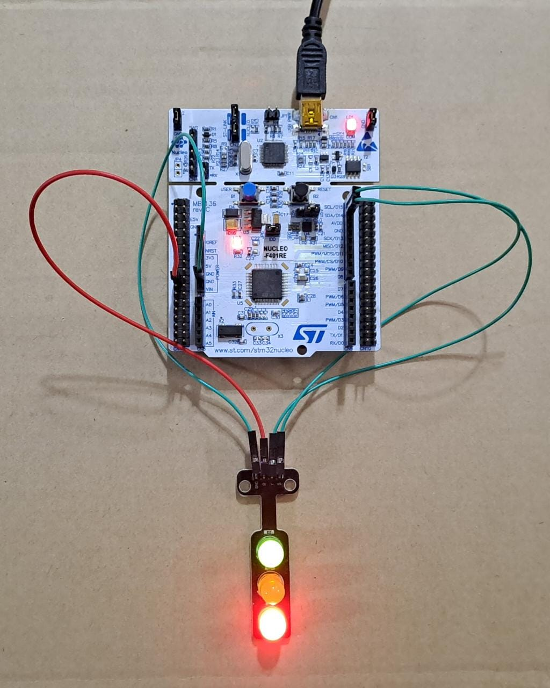

# Practica 4 - Programacion de Microcontroladores (CESE 2023)

## RESUMEN
- Plataforma de desarrollo 
- Objetivos
- Ubicacion de archivos
- Variables y macros
- Funciones implementadas

## Plataforma de desarrollo


Compilado y probado para la placa de desarrollo **ST NUCLEO-F401RE**

**NOTA:** Este ejercicio utiliza las salidas GPIOB pin 7,8 y 9 cableadas a 3 leds externos.

## Objetivos
Implementar un FSM (Finite State Machine) para trabajar con anti-rebotes de teclas por software.

La FSM permite leer el estado del pulsador de la placa NUCLEO-F401RE y genera acciones o eventos ante un flanco descendente o ascendente.

La FSM tiene el siguiente esquema
(FSM_Pract4.jpg)
 
El tiempo de anti-rebote es de 40 ms y se utiliza un retardo no bloqueante implementado en el modulo API_delay.
Cuando se detecta pulsador presionado se "togglea" el led 1 (pin 7) y cuando se detecta pulsador liberado
se togglea el led 3 (pin 9). 

## Ubicacion y archivos
```bash
├───Drivers
│    ├───API
│    │   ├───Inc     <--- API_delay.h
│    │   └───Scr     <--- API_delay.c
│    ├───Core
│    ├───CMSIS
│    └───STM32F4xx_HAL_Driver
├───Inc      <--- main.h
├───Src      <--- main.c
```

## Variables y macros
```C
#define DURATION_MAX 86400000		// Define macro retardo maximo en [ms], equivale a un dia
#define DURATION_MIN 0				// Define macro retardo minimo en [ms], cero
#define DURATION_DELAY 40           // Define duracion del retardo en 40 ms

typedef uint32_t tick_t;
typedef bool bool_t;
typedef struct{				
	tick_t startTime;			
	tick_t duration;				
	bool_t running;				
} delay_t;

typedef enum{
BUTTON_UP,
BUTTON_FALLING,
BUTTON_DOWN,
BUTTON_RISING,
} debounceState_t;
```

## Funciones implementadas
```C
void delayInit( delay_t * delay, tick_t duration );
bool_t delayRead( delay_t * delay );
void delayWrite( delay_t * delay, tick_t duration );
void API_Error_Handler(void);

void debounceFSM_init();		// debe cargar el estado inicial
void debounceFSM_update();		// debe leer las entradas, resolver la lógica de
								// transición de estados y actualizar las salidas
void buttonPressed();			// debe invertir el estado del LED1
void buttonReleased();			// debe invertir el estado del LED3
```
