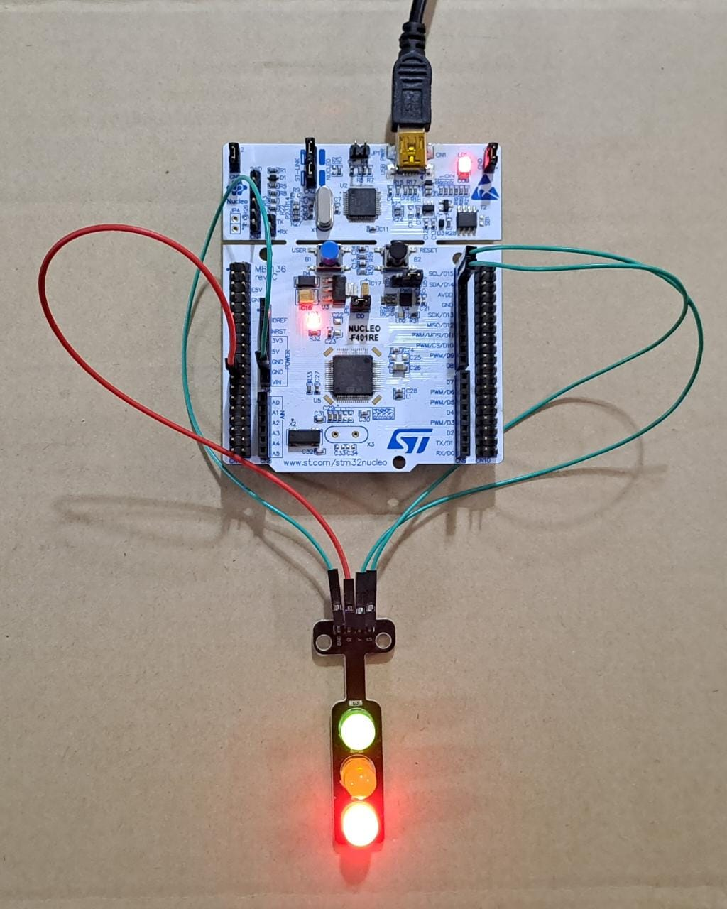

# Practica 5 - Programacion de Microcontroladores (CESE 2023)

## RESUMEN
- Plataforma de desarrollo 
- Objetivos
- Ubicacion de archivos
- Variables y macros
- Funciones implementadas

## Plataforma de desarrollo
5
Compilado y probado para la placa de desarrollo **ST NUCLEO-F401RE**

**NOTA:** Este ejercicio utiliza las salidas GPIOB pin 7,8 y 9 cableadas a 3 leds externos.
		  Utiliza el puerte serie por default utilizado a traves del cable USB y requiere
		  un emulador de puerto serie para recibir los mensajes enviados (CuteCom por ej.)

## Objetivos

Implementar un módulo de software en un archivo fuente API_uart.c con su correspondiente 
archivo de cabecera API_uart.h y ubicarlos en el proyecto dentro de las carpetas 
/drivers/API/src y /drivers/API/inc, respectivamente.
En API_uart.h se deben ubicar los prototipos de las funciones públicas.

```C
bool_t uartInit();
void uartSendString(uint8_t * pstring);
void uartSendStringSize(uint8_t * pstring, uint16_t size);
void uartReceiveStringSize(uint8_t * pstring, uint16_t size);
```

En API_uart.c se deben ubicar los prototipos de las funciones privadas y 
la implementación de todas las funciones de módulo, privadas y públicas.

## Ubicacion y archivos
```bash
├───Drivers
│    ├───API
│    │   ├───Inc     <--- API_delay.h API_debounce.h API_uart.h
│    │   └───Scr     <--- API_delay.c API_debounce.c API_uart.c
│    ├───Core
│    ├───CMSIS
│    └───STM32F4xx_HAL_Driver
├───Inc      <--- main.h
├───Src      <--- main.c
```

## Variables y macros
```C
#define DURATION_MAX 86400000		// Define macro retardo maximo en [ms], equivale a un dia
#define DURATION_MIN 0				// Define macro retardo minimo en [ms], cero
#define DURATION_DELAY 40           // Define duracion del retardo en 40 ms

typedef uint32_t tick_t;
typedef bool bool_t;
typedef struct{				
	tick_t startTime;			
	tick_t duration;				
	bool_t running;				
} delay_t;

typedef enum{
BUTTON_UP,
BUTTON_FALLING,
BUTTON_DOWN,
BUTTON_RISING,
} debounceState_t;
```

## Funciones implementadas
```C
void delayInit( delay_t * delay, tick_t duration );
bool_t delayRead( delay_t * delay );
void delayWrite( delay_t * delay, tick_t duration );
void API_Error_Handler(void);

void debounceFSM_init();		
void debounceFSM_update();										
void buttonPressed();			
void buttonReleased();		
```
