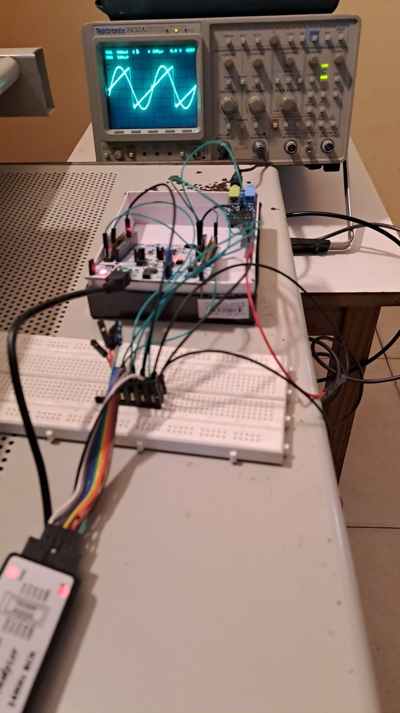
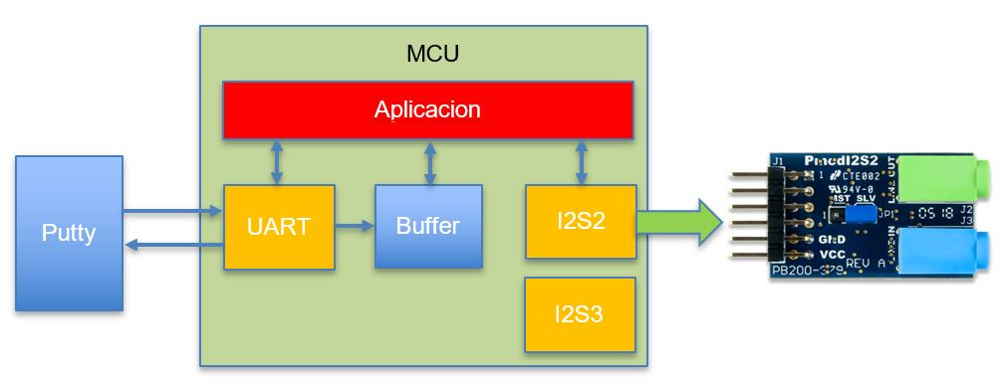
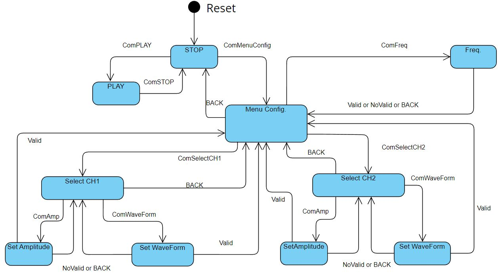
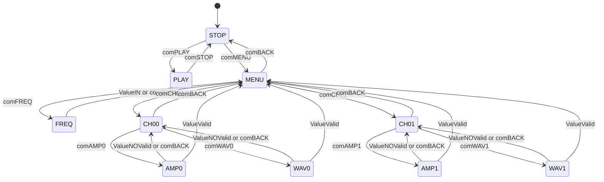

# TP Final - CESE 2023 
# Programacion de Microcontroladores y Protocolos de Comunicacion en S.E.

## RESUMEN
- Plataforma de desarrollo 
- Descripcion del trabajo
- Diagrama en bloques
- Maquina de estado para la operacion
- Modulos programados
- Ubicacion y archivos

## Plataforma de desarrollo

Compilado y probado para la placa de desarrollo **ST NUCLEO-F401RE**

**NOTA:** Este trabajo utiliza los perifericos I2S, UART, NVIC.

## Descripcion del trabajo
Desde el periferico I2S se transmite en PCM 2 señales de onda seleccionables en forma, frecuencia y amplitud.
Las señales son convertidas de digital a analogico a traves del modulos PmodI2S2 de Digilent (https://digilent.com/shop/pmod-i2s2-stereo-audio-input-and-output/)
Desde la UART se opera el sistema a traves de comandos definidos y se ingresan los valores de forma, frecuencia y amplitud.
La recepcion de comandos y datos en la UART y la transmision de datos por I2S son no bloqueantes, es decir, se realizan por interrupciones.

## Diagrama en bloques


## Maquina de estado finitos
Se implementa una maquina de estado finitos para la operacion del sistema a traves del ingreso de comandos y datos desde la UART.
Para las pruebas se utilizó el software RealTerm. 
 




## Modulos programados

| Modulo | Descripcion |
| --- | --- |
| API_delay | Implementa retardos No Bloqueantes |
| API_i2s | Implementa la comunicacion I2S |
| API_uart | Implementa la comunicacion serie |
| API_waveGenFSM | Implementa la la operacion del sistema desde una maquina de estados finitos (FSM) |

## Ubicacion y archivos
```bash
├───Drivers
│    ├───API
│    │   ├───Inc     <--- API_delay.h API_uart.h API_i2s.h API_waveGenFSM.h
│    │   └───Scr     <--- API_delay.c API_uart.c API_i2s.c API_waveGenFSM.c
│    ├───Core
│    ├───CMSIS
│    └───STM32F4xx_HAL_Driver
├───Inc      <--- main.h
├───Src      <--- main.c
```

## Funciones implementadas

Modulo API_delay
```C
void delayInit( delay_t * delay, tick_t duration );
bool_t delayRead( delay_t * delay );
void delayWrite( delay_t * delay, tick_t duration );
```

Modulo API_i2s
```C
bool_t i2sInit();											
void startI2S(void);										
void stopI2S(void);											
channel* readChannelProperty(uint8_t ch);					
void setFreqChannels(uint16_t freq);						
void setAmpChannel(uint8_t n_channel, uint8_t amplitude);	
void setWaveChannel(uint8_t n_channel, wave_t wave_type);		
```

Modulo API_uart
```C
bool_t uartInit();
void uartSendString(uint8_t * pstring);
void uartSendStringSize(uint8_t * pstring, uint16_t size);
bool_t eventCommand();
bool_t eventValue();
uint8_t* readCommand();
uint16_t readValue();
```

Modulo API_waveGenFSM
```C
void waveGenFSM_init();
void waveGenFSM_update();	
```