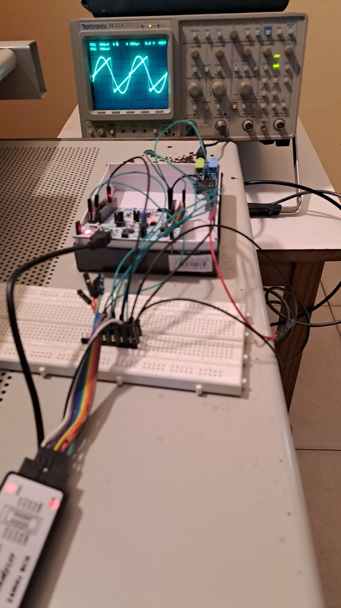

# TP Final - CESE 2023 
# Programacion de Microcontroladores y Protocolos de Comunicacion en S.E.

## RESUMEN
- Plataforma de desarrollo 
- Descripcion del trabajo
- Diagrama en bloques
- Maquina de estado para la operacion
- Modulos programados

## Plataforma de desarrollo

Compilado y probado para la placa de desarrollo **ST NUCLEO-F401RE**

**NOTA:** Este trabajo utiliza los perifericos I2S, UART, NVIC.

## Descripcion del trabajo
Desde el periferico I2S se transmite en PCM 2 señales de onda seleccionables en forma, frecuencia y amplitud.
Las señales son convertidas de digital a analogico a traves del modulos PmodI2S2 de digilent.
Desde la UART se opera el sistema a traves de comandos definidos y se ingresan los valores de forma, frecuencia y amplitud.
La recepcion de comandos y datos en la UART y la transmision de datos por I2S son no bloqueantes, es decir, se realizan por interrupciones.

## Diagrama en bloques


## Maquina de estado finitos
Se implementa una maquina de estado finitos para la operacion del sistema a traves del ingreso de comandos y datos desde la UART.
Para las pruebas se utilizó el software RealTerm.  


```C
bool_t uartInit();
void uartSendString(uint8_t * pstring);
void uartSendStringSize(uint8_t * pstring, uint16_t size);
void uartReceiveStringSize(uint8_t * pstring, uint16_t size);
```

En API_uart.c se deben ubicar los prototipos de las funciones privadas y 
la implementación de todas las funciones de módulo, privadas y públicas.

## Ubicacion y archivos
```bash
├───Drivers
│    ├───API
│    │   ├───Inc     <--- API_delay.h API_debounce.h API_uart.h
│    │   └───Scr     <--- API_delay.c API_debounce.c API_uart.c
│    ├───Core
│    ├───CMSIS
│    └───STM32F4xx_HAL_Driver
├───Inc      <--- main.h
├───Src      <--- main.c
```

## Variables y macros
```C
#define DURATION_MAX 86400000		
#define DURATION_MIN 0				
#define DURATION_DELAY 40           
#define USARTx USART2

typedef uint32_t tick_t;
typedef bool bool_t;
typedef struct{				
	tick_t startTime;			
	tick_t duration;				
	bool_t running;				
} delay_t;

typedef enum{
BUTTON_UP,
BUTTON_FALLING,
BUTTON_DOWN,
BUTTON_RISING,
} debounceState_t;
```

## Funciones implementadas
```C
void delayInit( delay_t * delay, tick_t duration );
bool_t delayRead( delay_t * delay );
void delayWrite( delay_t * delay, tick_t duration );
void API_Error_Handler(void);

void debounceFSM_init();		
void debounceFSM_update();										
void buttonPressed();			
void buttonReleased();
bool_t readKey();	

bool_t uartInit();
void uartSendString(uint8_t * pstring);
void uartSendStringSize(uint8_t * pstring, uint16_t size);
void uartReceiveStringSize(uint8_t * pstring, uint16_t size);
static uint16_t sizeArray(uint8_t *pstring);		
```
